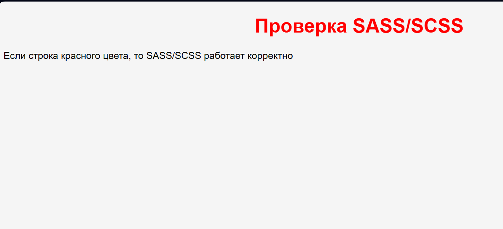

#  работа с SCSS/SASS/Less и TypeScript

---

## 1. План работы

### Часть 1. SCSS / SASS / Less
В этой части рассмотрены:

1. Установка SASS/SCSS и настройка компиляции в реальном времени из `.scss/.sass` в `.css`.
2. Создание страницы со списком чисел от 1 до 100 и окрашивание каждого числа в собственный цвет по формуле `rgb(n, 256 - n, 0)` с использованием циклов SCSS/SASS.
3. Верстка страницы с использованием вложенных правил и миксинов.
4. Синтаксис **SASS**.
5. Синтаксис **Less**.

### Часть 2. TypeScript
В этой части рассмотрены:

1. Установка TypeScript и настройка компиляции в реальном времени из `.ts` в `.js`.
2. Создание класса `User` с полями `name`, `age` и методом `hello()` с типизацией через **интерфейс**.
3. Типизация класса `User` с помощью **псевдонима типа** (`type`).
4. Реализация перегруженной функции `distance` для вычисления расстояния между двумя точками.
5. Реализация класса бинарного дерева с методами поиска, вставки, удаления, изменения элемента и вычисления высоты дерева.
6. Реализация паттернов  **Adapter**, **Strategy**, **Observer** .

---

## 2. Структура задачи

```text
/
├── sass_scss/
│   ├── tsk1/
│   │   ├── index.html
│   │   ├── scss/
│   │   │   └── style.scss
│   │   ├── sass/
│   │   │   └── style.sass
│   │   ├── less/
│   │   │   └── style.less
│   │   └── css/
│   │       └── style.css
│   ├── tsk2/
│   │   ├── index.html
│   │   ├── scss/
│   │   │   └── style.scss
│   │   ├── sass/
│   │   │   └── style.sass
│   │   ├── less/
│   │   │   └── style.less
│   │   └── css/
│   │       └── style.css
│   └── tsk3/
│       ├── index.html
│       ├── scss/
│       │   └── style.scss
│       ├── sass/
│       │   └── style.sass
│       ├── less/
│       │   └── style.less
│       └── css/
│           └── style.css
│
└── typeScript/
    ├── tsk1/
    │   ├── app.ts
    │   ├── app.js
    │   └── tsconfig.json
    ├── tsk2/
    │   ├── app.ts
    │   ├── app.js
    │   └── tsconfig.json
    ├── tsk3/
    │   ├── app.ts
    │   ├── app.js
    │   └── tsconfig.json
    ├── tsk4/
    │   ├── app.ts
    │   ├── app.js
    │   └── tsconfig.json
    ├── tsk5/
    │   ├── app.ts
    │   ├── dist/
    │   └── tsconfig.json
    └── tsk6/
        ├── app.ts
        ├── dist/
        └── tsconfig.json
```

---

## 3. Часть 1 - SCSS / SASS / Less

## 3.1. Установка Sass

Для работы с SCSS/SASS был установлен Node.js, после чего через `npm` установлен Sass:

```bash
npm install -g sass
```

### Компиляция SCSS в CSS
Разовая компиляция:

```bash
sass scss/style.scss css/style.css
```

Компиляция в режиме отслеживания изменений:

```bash
sass --watch scss/style.scss:css/style.css
```

### Компиляция SASS в CSS

```bash
sass --watch sass/style.sass:css/style.css
```

### Компиляция папки целиком

```bash
sass --watch scss:css
```

Если в директории N файлов.

---

## 3.2. 1 - настройка компиляции

Настроить автоматическую перекомпиляцию исходных файлов `.scss` и `.sass` в обычный `.css`.

- в HTML подключается **только CSS**;
- браузер не работает напрямую с `.scss` и `.sass`;
-  используется режим `--watch`, чтобы после каждого сохранения файла CSS обновлялся автоматически.

Подключение в HTML:

```html
<link rel="stylesheet" href="css/style.css">
```


---

## 3.3. 2 - числа от 1 до 100

создать страницу, содержащую числа от 1 до 100. Каждое число получало свой цвет по формуле:

```text
red = n
green = 256 - n
blue = 0
```

использовался цикл SCSS:

```scss
@for $i from 1 through 100 {
  .num-#{$i} {
    color: rgb($i, 256 - $i, 0);
  }
}
```

аккуратно за счёт `Flexbox`:

```scss
.numbers {
  display: flex;
  flex-wrap: wrap;
  gap: 10px;
  justify-content: center;
}
```

## 3.4. 3 - макет по образцу

Сверстать страницу по образцу:

- заголовок «Логотип»;
- горизонтальное меню;
- блок «Характеристика»;
- три колонки;
- футер.

Миксин:

```scss
@mixin flex-center {
  display: flex;
  justify-content: center;
  align-items: center;
}
```

Вложенные правила:

```scss
.page {
  .menu {
    a {
      color: $link-color;
    }
  }
}
```

---

## 3.5. 4 - переписывание на SASS

Первые три задания были переписаны на синтаксис **SASS**.

Пример:

```sass
$mainColor: blue

h1
  color: $mainColor
  text-align: center
```

---

## 3.6. 5 - переписывание на Less

Первые три задания были переписаны на **Less**.

Для работы с Less использовались:

- переменные через `@`;
- миксины;
- рекурсивная конструкция для генерации повторяющихся стилей.


Разовая компиляция:

```bash
lessc less/style.less css/style.css
```

Автоматическая компиляция:

```bash
less-watch-compiler less css
```

Less для задания с числами:

```less
.loop(@i) when (@i <= 100) {
  .num-@{i} {
    color: rgb(@i, (256 - @i), 0);
  }
  .loop((@i + 1));
}

.loop(1);
```

---

## 4. Часть 2 - TypeScript

## 4.1. Установка TypeScript

ЧТобы работать с  TypeScript был установлен компилятор `tsc`:

```bash
npm install -g typescript
```

Разовая компиляция:

```bash
tsc app.ts
```

Компиляция в реальном времени:

```bash
tsc app.ts --watch
```

---

## 4.2. Начало - компиляция TypeScript

компиляция `.ts` файла в `.js` файл в реальном времени.

То есть:

```text
app.ts → tsc → app.js
```

После каждого сохранения файла `app.ts` компилятор автоматически обновляет `app.js`.

---

## 4.3. 2 - класс User и интерфейс

 `User` с полями:

- `name: string`
- `age: number`

и методом:

- `hello(): void`

Метод выводит строку:

```text
Hi! My name is <name>. And I am <age> years old.
```


---

## 4.4. 3 - псевдоним типа

`User` был повторно типизирован, через `type`.

```ts
type UserType = {
  name: string;
  age: number;
  hello(): void;
};
```

---

## 4.5. 4 - перегруженная функция distance

Перегрузить функцию `distance` [ вычисляющая расстояние между двумя точками ].

два варианта вызова:

```ts
distance(x1, y1, x2, y2)
distance(p1, p2)
```

где `p1` и `p2` - объекты вида:

```ts
{ x: number, y: number }
```

Для описания точки использовался тип:

```ts
type Point = {
  x: number;
  y: number;
};
```


Без использования `any`.

---

## 4.6. 5 - бинарное дерево

Реализовать класс бинарного дерева поиска.

Поддержаны методы:

- `insert(value: number): void` - вставка элемента;
- `search(value: number): boolean` - поиск элемента;
- `delete(value: number): void` - удаление элемента;
- `update(oldValue: number, newValue: number): boolean` - изменение элемента;
- `height(): number` - определение высоты дерева.


---

## 4.7. 6 - паттерны Adapter, Strategy, Observer

Реализовать три паттерна проектирования.

### Adapter
Позволяет использовать старый класс через новый интерфейс.

`OldPrinter` с методом `write()` был адаптирован к интерфейсу `Printer` с методом `print()`.

### Strategy
Позволяет менять алгоритм во время выполнения программы.

Пример: `Navigator` использует разные стратегии построения маршрута:

- на машине;
- пешком;
- на велосипеде.

### Observer
Позволяет одному объекту уведомлять нескольких подписчиков о событии.

Пример: `NewsPublisher` уведомляет подписчиков о публикации новой новости.

---
